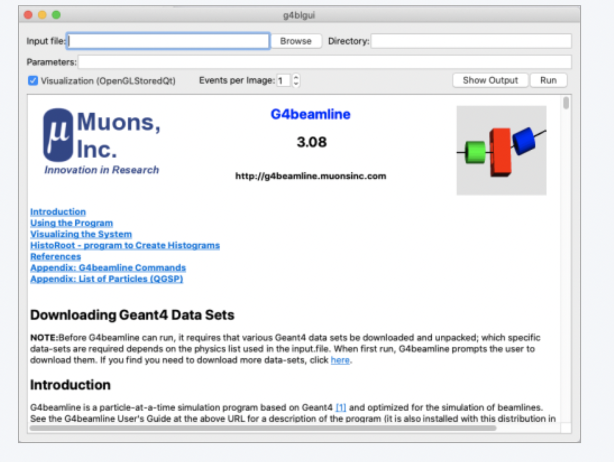
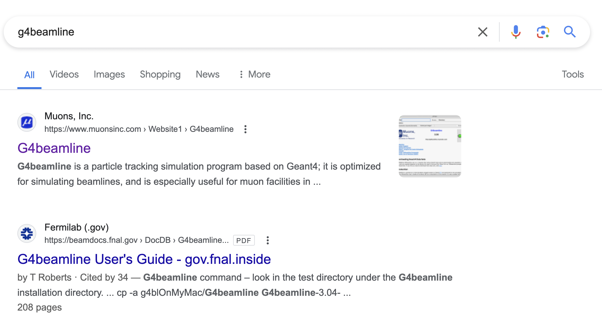
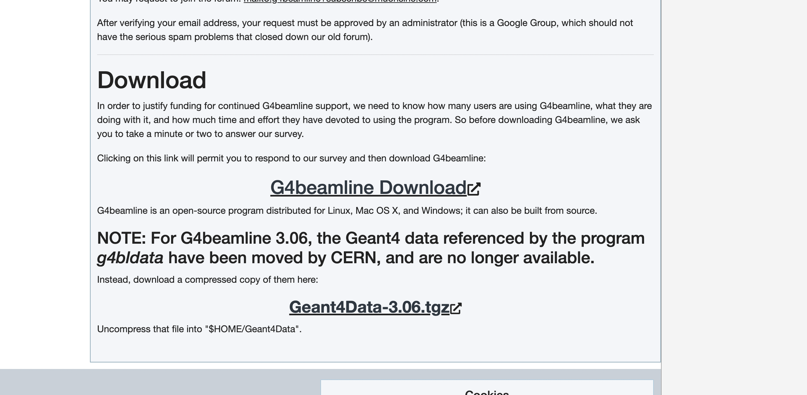
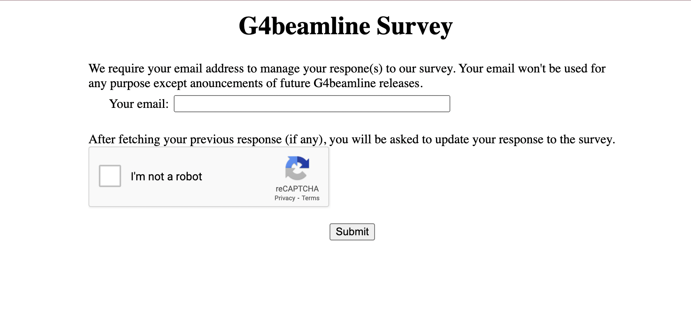
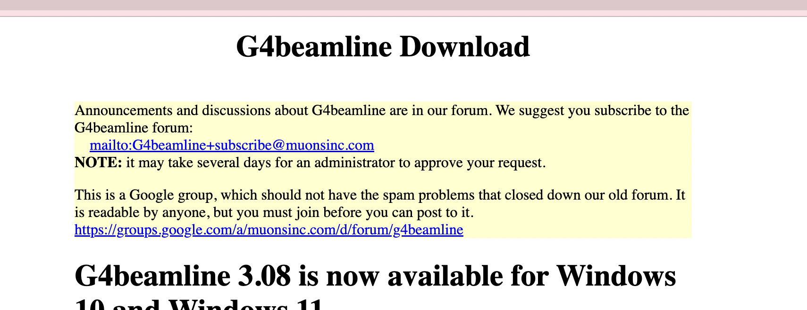
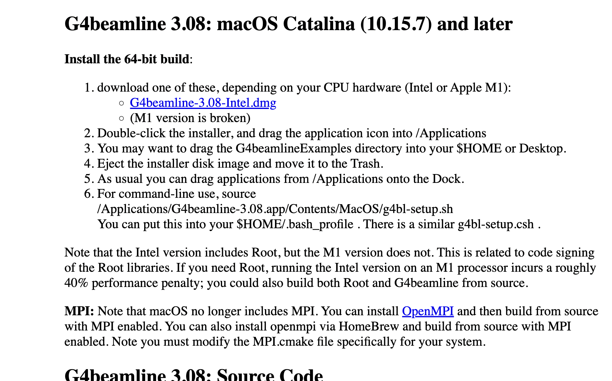

Welcome to Jasmine's Presentation
===
Hi, welcome to Jasmine's presentation about G4beamline and the g4bl-suite.

- Myself
- Overview of G4beamline
- Overview of g4bl-suite

<!-- end_slide -->


G4Beamline Overview
===
- Easier to use version of Geant4
- Optimized for simulating beamline
- Realistic simulations with swappable physics lists
- No C++ programming, only 1 ASCII file.
- Scriptable with Python
- Permit visualization



<!-- end_slide -->

G4Beamline Installation
===

Search for G4beamline, and look for the one with muonsinc, click on it.



<!-- end_slide -->

G4Beamline Installation
===

Scroll down and click on G4beamline Download


<!-- end_slide -->

G4Beamline Installation
===

Fill out the survey and all that, and click on SUBMIT



<!-- end_slide -->

G4Beamline Installation
===

You will be delivered to a website for downloading the installation.




<!-- end_slide -->

G4Beamline Installation
===

- Then scroll down for your appropriate version. 
- Install your version based on your operating system



<!-- end_slide -->


g4bl-suite Introduction
===

The G4beamline simulation ultimately:

- Does not output data in a very user-friendly format. For exapmle: You have to read documentation to know which column 
of the data is the x momentum or y postion value.

- Lack some powerful parameterization and automation in terms of search space for physic interns

I then wrote g4bl-suite to help Erica and Wes with data analyzing.

<!-- end_slide -->

What is g4bl-suite
===

A collection of user-friendly functionalities for scripting g4beamline and data analysis.

Runs straight in your python code. Whether it is `.py` python file or `.ipynb` notebook.
So you can ultilize python's strong scripting capabilities.

Easy to use and easy to set up.

Automatically tracks the computation progress

Is a lightweight wrapper that calls g4beamline behind the scene to run it for you.

Uses dollar sign - `$` and/or pipe symbol - `|` in g4beamline's variables' name to automate your code


<!-- end_slide -->

g4bl-suite installation and usage
===

```shell
# In your terminal, with python and pip installed
pip install git+https://github.com/badumbatish/fermi_proj@main
```
<!-- end_slide -->

g4bl-suite Data Analyzer
===

```python
# Import the Data Analyzer like this.
from g4bl_suite import DataAnalyzer

# Initialize a DataAnalyzer with your data's file name like this
da = DataAnalyzer("mydata.txt")

# Get the raw data
raw_data = da.get_data()
# Extract your data, do things with them.
pi_minus_data = da.extract_particle_data(raw_data, "pi-")

# This provides common utilities

# Collect the x momentum of the pi- data
x_angles_pi = da.get_x_angle(pi_minus_data)
```


<!-- end_slide -->
